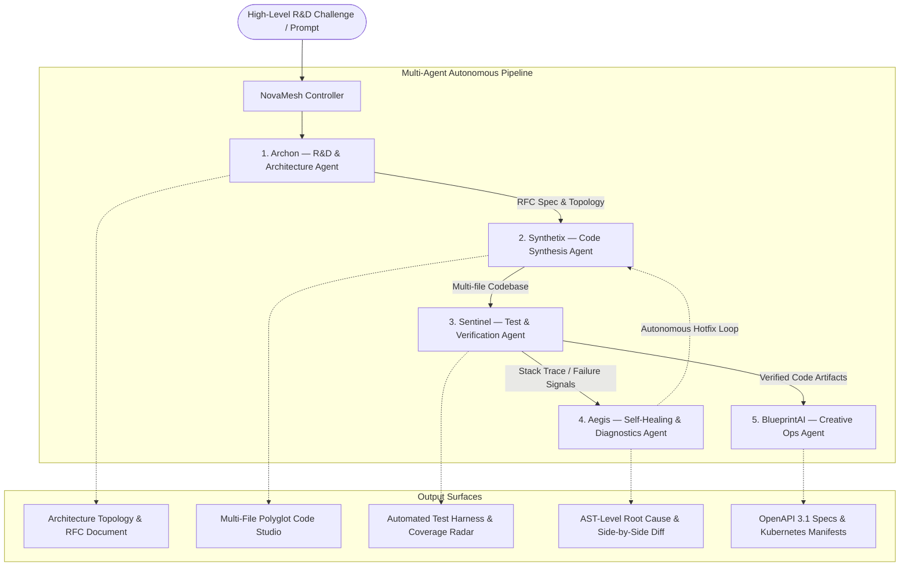

# NovaMesh AI — Autonomous Multi-Agent Software R&D & Self-Healing Orchestration Studio

> **Track**: BITSom Vertex Fest — Innovation AI Track  
> **Problem Theme**: *"Push technical boundaries with multi-agent systems and software automation. Engineer intelligent agents that accelerate R&D, code synthesis, workflow orchestration, or creative execution."*

[](https://reactjs.org/)
[](https://vitejs.dev/)
[](https://www.typescriptlang.org/)
[](https://tailwindcss.com/)
[](https://aistudio.google.com/)

---

## 🌟 Executive Summary

**NovaMesh AI** is a state-of-the-art **Autonomous Multi-Agent Software R&D and Self-Healing Orchestration Studio**. It replaces brittle, single-turn LLM code generation with a resilient, decentralized network of 5 specialized AI agents collaborating in an asynchronous Directed Acyclic Graph (DAG). 

From high-level system requirements to production-grade polyglot code, comprehensive automated test suites, closed-loop self-healing bug fixes, and deployment manifests, NovaMesh AI provides an autonomous end-to-end software factory.

---

## 🏗️ 5-Agent Collaborative Network



### Specialized Agent Profiles

| Agent | Role | Focus & Responsibilities |
| :--- | :--- | :--- |
| **Archon** 📐 | *R&D & Architecture* | Analyzes algorithmic trade-offs, formulates formal RFCs, designs distributed topologies, and defines throughput and latency SLA targets. |
| **Synthetix** ⚡ | *Code Synthesis* | Synthesizes production-ready, multi-file codebases in TypeScript, Go, Python, and SQL adhering strictly to architectural constraints. |
| **Sentinel** 🛡️ | *Verification & QA* | Autonomously writes test suites (unit, integration, concurrency, fuzzing), calculates code coverage, and profiles execution latency. |
| **Aegis** 🔮 | *Self-Healing & SRE* | Intercepts runtime exceptions and stack traces, performs AST root-cause analysis, and autonomously writes hotfix diffs in a closed loop. |
| **BlueprintAI** 🚀 | *Creative Execution & Ops* | Generates interactive OpenAPI 3.1 contracts, production Kubernetes StatefulSets/DaemonSets, Docker manifests, and ASCII topology maps. |

---

## 🚀 Key Platform Features

### 1. Dynamic DAG Orchestration Visualizer
- Real-time interactive node graph reflecting agent states: `Standby`, `Reasoning`, `Processing`, `Synthesized`, `Anomaly`.
- Dynamic inter-agent dataflow channels showing RFC specs, codebase transfers, and test harness execution.
- Telemetry panel tracking latency per agent node (ms) and token utilization.

### 2. Live Inter-Agent Message Bus
- Real-time event broker recording all inter-agent messages and payload transfers.
- Filter by specific agent or stream the unified global bus.
- Expandable / collapsible terminal UI with payload details.

### 3. Multi-File Polyglot Code Studio
- Clean tabbed interface supporting multi-language codebases (`TypeScript`, `Go`, `Python`, `SQL`, `YAML`).
- Syntax-highlighted code viewer with line numbers and 1-click clipboard copy.
- 1-click download button for individual source modules.

### 4. Interactive Self-Healing Sandbox
- **Simulate Runtime Fault**: Injects realistic production failures (e.g., *TOCTOU Race Condition*, *Unbounded Buffer Allocation*, *Goroutine Deadlock*, *Discontinuous Graph Index*).
- **Decompiled Stack Trace**: Inspect line numbers and error types in real time.
- **Side-by-Side AST Diff**: Compare original vulnerable code against Aegis's autonomous hotfix patch.
- **Autonomous Verification**: Verifies patched code against Sentinel's test runner with 0 regressions.

### 5. Dual-Engine Capability
- **Zero-Latency Resilience Mode**: 4 pre-engineered enterprise scenarios ready for instant hackathon evaluation without API keys or internet dependency.
- **Live Google Gemini API Integration**: Built-in configuration modal supporting Google AI Studio API keys with `gemini-2.5-flash`, `gemini-2.0-flash`, and `gemini-1.5-pro`.

---

## 📦 4 Pre-Engineered Enterprise Scenarios

1. **Distributed Event-Driven Payment Gateway** (`FinTech / Distributed Systems`):
   - *Throughput*: 50,000 tx/sec | *Latency SLA*: p99 < 12ms
   - *Stack*: TypeScript (Ledger Engine), Go (Worker Pool), PostgreSQL (Timescale Partitioning), Kafka WAL.
   - *Fault Injected*: TOCTOU concurrency race condition in ledger deductions, patched with atomic mutex locks.

2. **Distributed Vector Search & Neural Reranker** (`AI Infrastructure / MLOps`):
   - *Throughput*: 25,000 queries/sec | *Latency SLA*: p99 < 6ms
   - *Stack*: Python (HNSW SIMD Index), TypeScript (ONNX Cross-Encoder Reranker).
   - *Fault Injected*: Dangling C-extension tensor buffer memory leak, patched with geometric doubling buffer allocation.

3. **Autonomous Self-Healing Microservices Mesh** (`Cloud Native / DevOps`):
   - *Throughput*: 200,000 rps/node | *Latency SLA*: Overhead < 0.2%
   - *Stack*: Linux eBPF socket tracing, Go (Kubernetes Controller Reconciler), TypeScript (Token Bucket Circuit Breaker).
   - *Fault Injected*: Unbuffered channel deadlock on burst telemetry drain, patched with asynchronous ring buffers.

4. **Streaming Graph Neural Network Engine** (`Deep Learning / Graph AI`):
   - *Throughput*: 40,000 edges/sec | *Latency SLA*: Embedding < 15ms
   - *Stack*: Python (Temporal Edge Stream Aggregator), PyTorch Geometric (MPNN Layers), FastAPI (Fraud Alerts).
   - *Fault Injected*: Out-of-bounds tensor index on disconnected graph nodes, patched with identity self-loop clamping.

---

## 🛠️ Technology Stack

- **Frontend Core**: React 18 (TypeScript) + Vite 6
- **Styling**: Tailwind CSS + Custom Dark Glassmorphism Design System
- **Icons**: Lucide React
- **AI Core**: Google Gemini API (`gemini-2.5-flash`, `gemini-2.0-flash`, `gemini-1.5-pro`)
- **Fonts**: JetBrains Mono & Inter via Google Fonts

---

## 💻 Getting Started & Running Locally

### Prerequisites
- Node.js `v18.0.0` or higher
- npm `v9.0.0` or higher

### Installation
```bash
# 1. Clone the repository
git clone https://github.com/ujju2020/Innovation-AI-Agents.git
cd Innovation-AI-Agents

# 2. Install dependencies
npm install

# 3. Start the local development server
npm run dev
```

The application will be available at:
👉 **`http://localhost:5173/`**

### Production Build
```bash
npm run build
```
Generates an optimized production bundle in the `dist/` directory with zero errors.

---

## 🎯 Hackathon Evaluation Walkthrough (3-Minute Tour)

1. **Observe the Dynamic DAG**: Check the 5 collaborating agent nodes in the top orchestrator section.
2. **Execute Multi-Agent Mesh**: Click **"Execute Multi-Agent Mesh"** to watch the agents execute in sequence with live progress bars and inter-agent message logs.
3. **Inspect the Architecture RFC**: Open the **"R&D Architecture RFC"** tab to review Archon's system topology, throughput goals, and technical specifications.
4. **Browse Synthesized Code**: Switch to the **"Synthesized Codebase"** tab, click through the files (`ledger_service.ts`, `payment_worker.go`, `schema.sql`), and test 1-click code copying.
5. **Run Verification Harness**: Open the **"Verification Harness"** tab and click **"Re-Run Harness"** to watch the test runner validate all 12 test assertions.
6. **Trigger Self-Healing Sandbox**: Go to the **"Self-Healing Sandbox"** tab, click **"Simulate Runtime Fault"** to inspect the stack trace, and click **"Autonomous Hotpatch"** to see Aegis's side-by-side AST code diff patch.
7. **Switch Scenarios**: Use the scenario pills at the top to toggle between *Vector Search*, *Microservices Mesh*, or *Streaming GNN*.
8. **Test Gemini Live Mode**: Click **"API Config"** in the top navbar to enter a Google AI Studio API key and test live synthesis.

---

## 📄 License & Copyright

**Copyright (c) 2026 Ujjwal Kumar Bhowmick**  
- **Developer**: Ujjwal Kumar Bhowmick  
- **Email**: [ujjwalkumarbhowmick30@gmail.com](mailto:ujjwalkumarbhowmick30@gmail.com)  
- **All rights reserved.**
