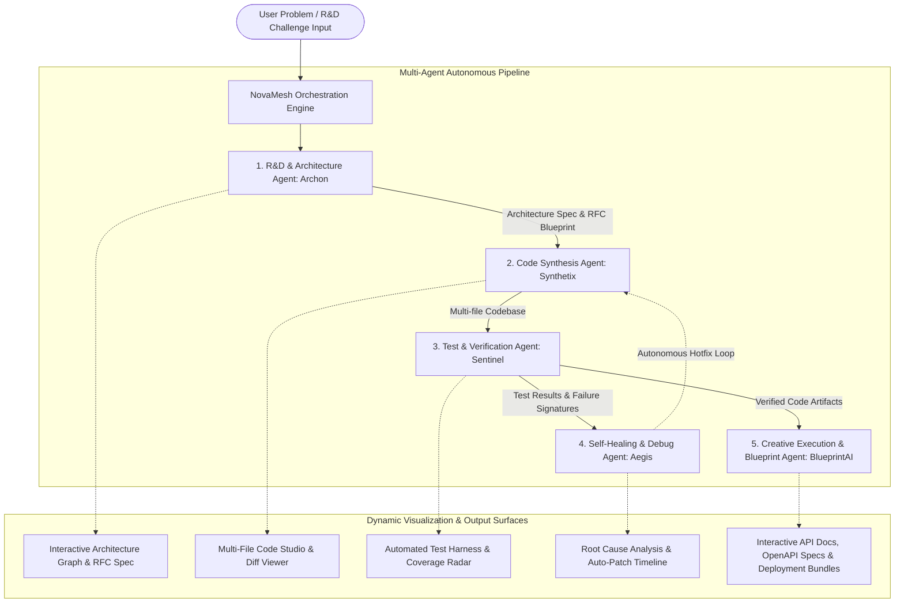

# NovaMesh AI — Autonomous Multi-Agent Software R&D & Orchestration Studio

## Executive Summary & Problem Analysis

Based on the [README.md](file:///c:/Users/Administration/Desktop/VibeCoding/BITSom%20Vertex%20Fest/Innovation-AI-Agents/README.md):
> *"Push technical boundaries with multi-agent systems and software automation. Engineer intelligent agents that accelerate R&D, code synthesis, workflow orchestration, or creative execution."*

### The Core Challenges in Modern Software R&D & Automation:
1. **Siloed & Fragmented Engineering Cycles**: Exploring novel technical architectures, designing RFCs, writing code, generating tests, and orchestrating deployments require disparate tools and substantial context-switching.
2. **Brittle Single-Agent Prompting**: Simple LLM chat assistants lack systemic reasoning, cannot maintain shared state across architectural layers, and fail when synthesizing multi-component codebases.
3. **Absence of Autonomous Feedback & Self-Healing**: When synthesized code fails unit tests or linting, human engineers must manually debug and iterate rather than having an autonomous feedback loop.
4. **Opaque Workflow Orchestration**: Most agentic workflows operate as black boxes, making it difficult for developers and hackathon judges to inspect inter-agent communication, DAG task dependencies, token economics, and reasoning traces.

---

## The Proposed Solution: **NovaMesh AI**

**NovaMesh AI** is an advanced **Autonomous Multi-Agent Software R&D & Orchestration Studio** powered by Google Gemini (Vertex AI). It introduces a visual, high-speed multi-agent operating system that accelerates the entire software lifecycle from problem conception to verified code synthesis and self-healing deployment.



---

## Specialized Multi-Agent Roles

| Agent Name | Role | Responsibilities & Deliverables |
| :--- | :--- | :--- |
| **Archon** *(R&D & Architecture)* | System Architect & Researcher | Analyzes problem constraints, selects optimal algorithms and tech stacks, generates system topology, RFC specifications, and modular component breakdown. |
| **Synthetix** *(Code Synthesis)* | Polyglot Software Engineer | Synthesizes clean, production-grade, multi-file codebases (frontend, backend, schemas, serverless workers) adhering strictly to Archon's RFC. |
| **Sentinel** *(Test & Verification)* | Quality & Security Assurance | Autonomously writes test suites (unit, integration, edge cases, fuzz tests), executes validation benchmarks, and profiles latency/memory bottlenecks. |
| **Aegis** *(Self-Healing & Diagnostics)* | Autonomous Site Reliability Engineer | Intercepts runtime errors and failed assertions, performs AST-level root-cause analysis, and issues closed-loop patch revisions back to Synthetix. |
| **BlueprintAI** *(Creative Execution)* | Documentation & Visual Blueprint | Generates interactive OpenAPI specifications, visual sequence diagrams, deployment scripts (Docker/K8s/Terraform), and technical whitepapers. |

---

## Key Platform Features & Demonstrator Capabilities

### 1. Dynamic DAG Multi-Agent Visualizer
- Real-time interactive node graph showing agent states: `Idle`, `Thinking`, `Synthesizing`, `Testing`, `Healing`, `Completed`.
- Live Inter-Agent Bus: View messages and payloads passed between agents in real time.
- Execution metrics: Latency per node, token utilization, and confidence scores.

### 2. Multi-File Code Synthesis & Live Diff Studio
- Clean tabbed code viewer supporting multiple synthesized files (e.g., `server.ts`, `authMiddleware.go`, `schema.sql`, `client.tsx`).
- Syntax highlighting, line numbers, 1-click copy, and file download.
- Visual side-by-side Diff Viewer showing original generated code vs. Aegis's self-healed patch.

### 3. Interactive Self-Healing Sandbox
- A dedicated fault injection simulator where users/judges can trigger simulated runtime faults (e.g., *Null Pointer Exception*, *Race Condition*, *Memory Leak*, *API Rate Limit Overrun*).
- Watch Aegis diagnose the stack trace in real time, draft an autonomous fix, and verify it with a green test run.

### 4. Zero-Setup Demo Suite & Live Gemini Integration
- **4 High-Impact Pre-Engineered R&D Presets** ready for instant zero-latency demoing:
  1. **Distributed Event-Driven Payment Gateway**: High-throughput distributed ledger with idempotent transaction processing and self-healing retry queues.
  2. **Real-Time Edge Computer Vision Pipeline**: Multi-camera low-latency stream processing with edge inference optimization.
  3. **High-Concurrency Distributed Vector Cache**: Sub-millisecond ANN search cluster with automatic sharding and rebalancing.
  4. **Autonomous Microservices Health Orchestrator**: Self-recovering container network with anomaly detection and auto-scaling.
- **Live Gemini 2.0 / 1.5 Flash API Key Integration**: Allows custom user prompts to execute live with Google's latest Gemini models.

---

## User Review Required

> [!IMPORTANT]
> **API Key & Hackathon Judge Experience**:
> The prototype will feature a dual-engine design:
> 1. **Instant Offline Showcase Engine**: Pre-loaded with realistic, rich multi-file codebases, DAG states, and test suites so judges can evaluate the system seamlessly without waiting for API keys or network latency.
> 2. **Live Gemini Engine**: Users can enter their Google Gemini API key to run real-time agent synthesis on any custom technical problem statement.

---

## Open Questions

1. **Focus of Code Generation**: Do you prefer the code synthesizer presets to showcase TypeScript/Python/Go fullstack architectures, or would you like to emphasize systems/cloud infrastructure (e.g. Terraform, Kubernetes, Rust)? *(Defaulting to a versatile TypeScript + Python + Go modern cloud stack)*.
2. **Interactive Capabilities**: Would you like an interactive execution playground where users can add custom agent nodes to the DAG pipeline dynamically?

---

## Proposed Technical Implementation

### Architecture & Tech Stack
- **Frontend Framework**: React 18 + Vite + TypeScript.
- **Styling**: Tailwind CSS + Custom Dark Glassmorphic Theme (`#090d16` deep space slate, glowing cyan `#06b6d4`, electric violet `#8b5cf6`, emerald green `#10b981`).
- **Icons**: Lucide React.
- **AI Service**: Google Gemini API client with fallback simulation engine.
- **Graph & Visualization**: Interactive SVG-based DAG canvas with pulse animations and active node glows.

### File Structure Plan
```
Innovation-AI-Agents/
├── index.html
├── package.json
├── vite.config.ts
├── tsconfig.json
├── tailwind.config.js
├── postcss.config.js
└── src/
    ├── main.tsx
    ├── App.tsx
    ├── types/
    │   └── agent.ts                # Interfaces for Agents, DAG Nodes, Code Files, Test Results, Logs
    ├── services/
    │   ├── geminiService.ts        # Gemini API integration & structured prompting
    │   └── mockScenarios.ts        # 4 deep R&D presets with multi-file code, tests, and self-healing traces
    ├── components/
    │   ├── Navbar.tsx              # Brand logo, API Key trigger, Quick Scenario Selector, Status badges
    │   ├── PromptInputSection.tsx  # R&D problem input, agent autonomy level, and 'Run Mesh' trigger
    │   ├── DAGOrchestrationGraph.tsx# Live visual DAG graph of collaborating agents with pulse effects
    │   ├── AgentMessageBus.tsx     # Real-time inter-agent communication stream and thought logs
    │   ├── tabs/
    │   │   ├── ArchitectureTab.tsx # System topology, RFC blueprint, and algorithmic trade-offs
    │   │   ├── CodeStudioTab.tsx   # Multi-file code viewer, syntax highlighting, 1-click export
    │   │   ├── TestVerificationTab.tsx # Test harness runner, unit/integration results, coverage radar
    │   │   ├── SelfHealingTab.tsx  # Fault injection, stack trace analysis, and side-by-side diff patch
    │   │   └── CreativeBlueprintTab.tsx # OpenAPI specs, sequence diagrams, and Docker/cloud manifests
    │   └── ApiKeyModal.tsx         # Gemini API Key setup and model selector (Gemini 2.0 Flash / 1.5 Pro)
    └── index.css                   # Glassmorphic styles, neon glows, custom scrollbars, and keyframes
```

---

## Verification Plan

### Automated Verification
- `npm run build`: Ensure zero TypeScript errors, clean JSX bundling, and successful Vite production build.

### Interactive Prototype Verification
1. **Pipeline Execution**: Select an R&D scenario or enter custom requirements; verify that the visual DAG orchestrator updates node states sequentially from *Archon* through *BlueprintAI*.
2. **Architecture Blueprint**: Check system topology, RFC summary, and component breakdowns in the Architecture tab.
3. **Multi-File Code Studio**: Switch between generated files (`server.ts`, `service.py`, `schema.sql`), test copy code, and inspect file trees.
4. **Test Verification**: Verify test passing rate, execution times, and simulated test assertions.
5. **Self-Healing Loop**: Test the "Inject Fault" button in the Self-Healing tab, observe Aegis detect the failure, trace the line number, generate a patch, and review the side-by-side diff.
6. **Gemini Live Key**: Test configuring an API key and submitting a custom prompt to verify live Google Gemini API connectivity.
